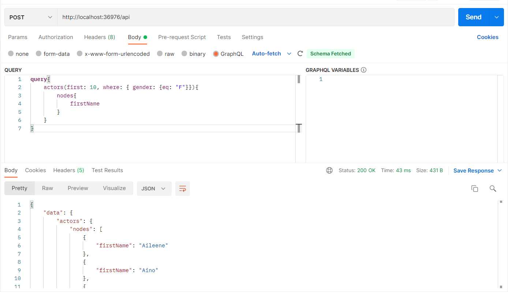

# Zdrojový kód pro diplomovou práci s názvem *Dotazovací jazyky pro webové API*
Tento projekt bsahuje implementaci dotazovacího jazyka **HotChocolate** na platformě .NET.

## Testování
Pro testování lze využít aplikaci Postman nebo jakýkoliv *tool* umožnující odesílání *POST* požadavku přes HTTP protokol.
### Základní příklady
**Všechny příklady se líší v *tělu* POST requestu. Odesílají se na následující endpoint:**
```
http://localhost:36976/api
```

**1. Projekce:**.
```
query{
    actors{
        nodes{
            firstName
            lastName
        }
    }
}
```
**2. Selekce:**.
```
query{
    actors(where: { gender: {eq: "F"}}){
        nodes{
            id
            firstName
            lastName
            gender
        }
    }
}
```
**3. Stránkování:**.
```
query{
    actors(first: 10){
        nodes{
            id
            firstName
            lastName
            gender
        }
    }
}
```
**4. Komplexní dotaz:**.
```
query{
    actors(first: 10, where: { gender: {eq: "F"}}){
        nodes{
            firstName
        }
    }
}
```

**Příklad nastavení Postman**

